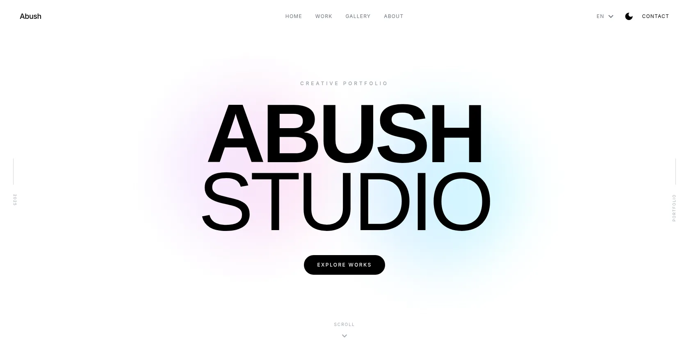
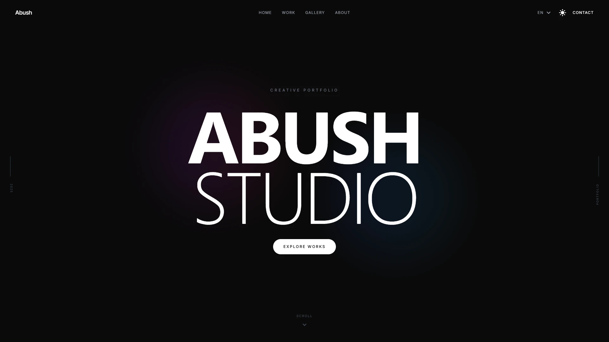
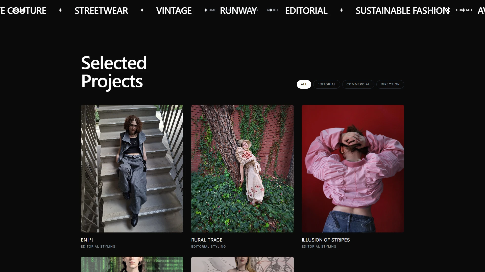
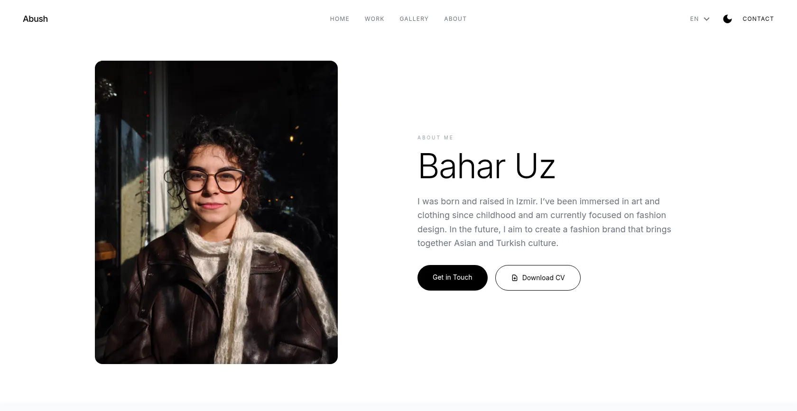
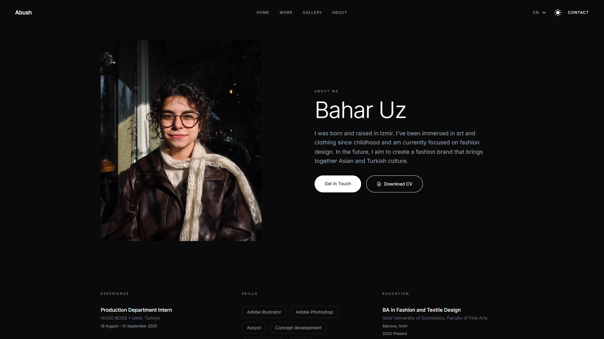
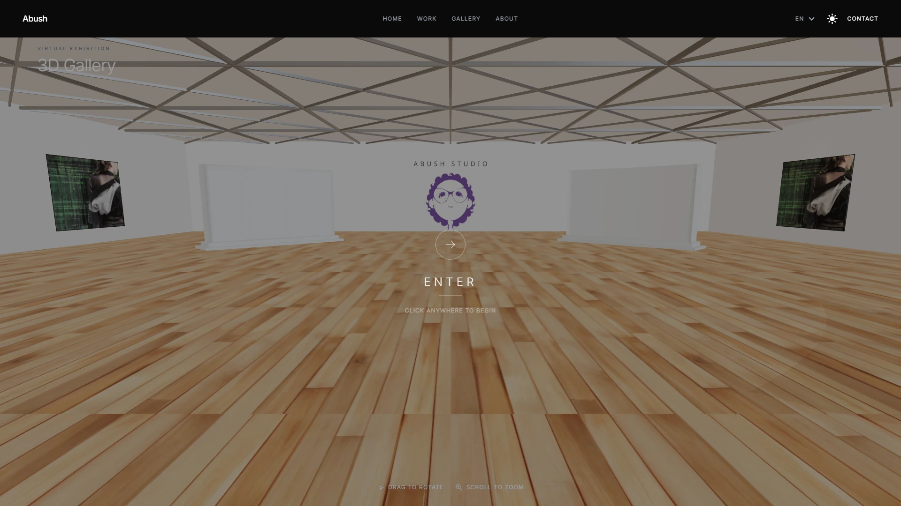
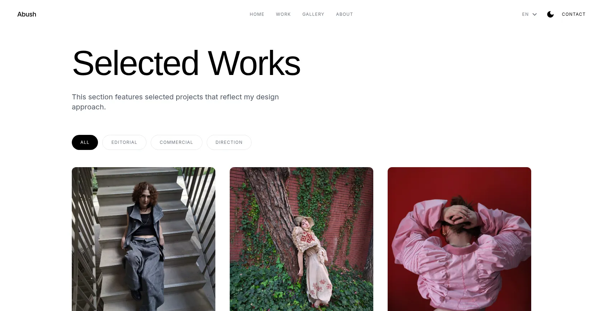

# Abush Studio Portfolio

### *Modern Creative Portfolio Showcasing 3D Art, Design & Interactive Experiences*

[About](#about) • [Features](#features) • [Screenshots](#screenshots) • [Tech Stack](#tech-stack) • [Contact](#contact)

---

## About

A high-performance portfolio website built for Abush Studio, showcasing creative work across 3D art, design, and interactive experiences. This modern web application combines smooth animations, multilingual support (EN/TR/JP), and comprehensive SEO optimization to deliver an exceptional user experience across all devices.

<table>
<tr>
<td width="33%" align="center">

✨ Clean, modern interface  
🎭 Interactive 3D gallery  
📱 Fully responsive  
⚡ Smooth animations

</td>
<td width="33%" align="center">

🚀 Next.js 16 App Router  
🖼️ WebP optimization  
⚙️ SSR & SSG  
💨 Lightning fast

</td>
<td width="33%" align="center">

🔍 Rich meta tags  
📊 Structured data  
🗺️ Dynamic sitemap  
🤖 Search optimized

</td>
</tr>
</table>

**What makes this special:**

Every detail is crafted to showcase creative work beautifully while maintaining optimal performance. From 3D gallery experiences to smooth scroll animations, this portfolio bridges aesthetic excellence with technical sophistication.

---

## Features

<table>
<tr>
<td width="33%" valign="top">

- Modern, clean interface
- Interactive 3D gallery
- Modal preview system
- Smooth scroll animations
- Custom animated components
- Responsive across all devices

</td>
<td width="33%" valign="top">

- Next.js 16 with App Router
- Image optimization (WebP)
- Server-side rendering
- Static site generation
- Code splitting
- Lazy loading

</td>
<td width="33%" valign="top">

- Full multilingual support (EN/TR/JP)
- Dynamic language switching
- Localized routes
- SEO for all languages
- Automatic locale detection
- next-intl integration

</td>
</tr>
<tr>
<td width="33%" valign="top">

- Comprehensive meta tags
- Open Graph support
- Twitter Card integration
- JSON-LD structured data
- Dynamic sitemap
- Robots.txt optimization

</td>
<td width="33%" valign="top">

- **3D Gallery** - Interactive experiences
- **Projects** - Creative work showcase
- **About** - Studio information
- Dynamic project pages
- High-quality WebP images
- Modal gallery view

</td>
<td width="33%" valign="top">

- Smooth page transitions
- Scroll-based reveals
- Interactive animations
- Mobile-optimized
- Touch gesture support
- Fast load times

</td>
</tr>
</table>

---

## Screenshots

*Homepage with animated hero section and smooth transitions*

  

<table>
<tr>
<td width="50%">

<b>Dark Mode</b>

</td>
<td width="50%">

<b>Projects Section</b>

</td>
</tr>
<tr>
<td width="50%">

<b>About Page - Light Mode</b>

</td>
<td width="50%">

<b>About Page - Dark Mode</b>

</td>
</tr>
<tr>
<td width="50%">

<b>Interactive 3D Gallery</b>

</td>
<td width="50%">

<b>Project Detail Page</b>

</td>
</tr>
</table>

---

## Tech Stack

| Technology | Purpose |
|------------|---------|
|  | React framework with App Router |
|  | Type-safe development |
|  | UI component library |
|  | Utility-first styling |
|  | 3D graphics library |
|  | Animation library |

---

## Performance

<table>
<tr>
<td width="33%" align="center">

⚡ Code splitting & lazy loading  
🖼️ Image optimization (WebP)  
📦 Optimized bundle size  
🎯 60fps animations

</td>
<td width="33%" align="center">

🔍 Meta tags & Open Graph  
📊 JSON-LD structured data  
🗺️ Dynamic sitemap  
🤖 Robots.txt configured

</td>
<td width="33%" align="center">

♿ Semantic HTML  
⌨️ Keyboard navigation  
🎨 High contrast support  
📱 Mobile optimized

</td>
</tr>
</table>

---

## Internationalization

<table>
<tr>
<td width="33%" align="center">

🇬🇧 Complete translation  
✅ 100% coverage  
🌐 All UI elements localized

</td>
<td width="33%" align="center">

🇹🇷 Native language support  
✅ 100% coverage  
🔄 Seamless language switching

</td>
<td width="33%" align="center">

🇯🇵 日本語サポート  
✅ 100% coverage  
🌏 Global reach

</td>
</tr>
</table>

---

## Contact

<table>
<tr>
<td width="50%" align="center">

### 

**Abush Studio**

**Bahar Uz**

Creative studio specializing in 3D art, design, and interactive experiences

*For portfolio inquiries and creative collaborations*

</td>
<td width="50%" align="center">

### 

**Görkem**

Full-stack developer specializing in modern web applications

*For website development inquiries and technical questions*

</td>
</tr>
</table>

---

**Made with ❤️ by Görkem**

*Bringing creative excellence to the modern web*

